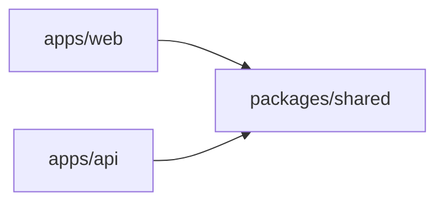

# Kanban board — project planning

This document translates the [Ravenna Coding Challenge](./Ravenna%20Coding%20Challenge.md) into a concrete plan: **Yarn workspaces monorepo**, chosen stacks, API shape, shared package scope, phased roadmap, and README checklist. It does not prescribe exact package versions (see [Dependency installs](#dependency-installs)).

---

## Goals and constraints

- **Product**: Small Kanban board with a React frontend and a backend API ([challenge brief](./Ravenna%20Coding%20Challenge.md)).
- **Timebox**: 4–6 hours (challenge expectation).
- **User model**: Challenge assumes a **single end user** (no login required). The **database** still includes a **`users`** table so boards have an owner (`boards.user_id` → `users.id`); the app can use one fixed or implicit user until real auth is added.
- **Evaluation (20 pts)**: Frontend implementation (7), product and interaction design (6), backend implementation (5), infrastructure and setup (2).
- **Submission**: Source code, README, assumptions and trade-offs, optional deployed link.

---

## Monorepo layout

```text
apps/
  web/              # React + Vite frontend
  api/              # Fastify backend
packages/
  shared/           # Shared types, Zod schemas, small utils
package.json        # Yarn workspaces root
```

### Package dependency flow

Both apps depend on `packages/shared` for contracts and validation; they do not depend on each other.



---

## Tooling

- **Package manager**: **Yarn** with **workspaces** (`"workspaces": ["apps/*", "packages/*"]` in the root `package.json`). Workspaces keep a single install, allow `workspace:` protocol for internal packages, and simplify root scripts (e.g. run `web` and `api` together with `concurrently` or separate terminals).
- **Root scripts** (to define during setup): `yarn install` at repo root; scripts such as `yarn workspace web dev`, `yarn workspace api dev`, and optionally a root `dev` that runs both.

---

## Dependency installs

- Add dependencies with **bare package names** — no version suffix in the command (e.g. `yarn workspace web add vite react react-dom`, `yarn workspace api add fastify`, `yarn add -D typescript`). Avoid documenting installs as `package@1.2.3` in this plan; Yarn resolves **latest** compatible releases for the workspace.
- **Reproducibility**: Commit **`yarn.lock`** so everyone and CI resolve the same tree.
- **Routine dependencies**: Refer to stacks by **package identity** below, not pinned semver numbers.

---

## Tech stack

| Layer | Choice | Role |
|--------|--------|------|
| Frontend app | React, Vite, TypeScript | SPA build and dev server |
| Styling | Tailwind CSS, shadcn/ui | Layout, components, accessible primitives |
| Drag and drop | @dnd-kit | Move cards between columns; reorder within a column |
| Client state | Zustand | Board/card UI state; explain choice in README |
| Forms | React Hook Form + Zod | Create/edit card modals; validation aligned with shared schemas |
| Backend | Fastify, Zod | HTTP API, request validation, consistent error shape |
| Persistence | Drizzle ORM, PostgreSQL | Users, boards, columns, cards; migrations |
| Shared | `packages/shared` | Zod schemas, inferred types, enums, small pure helpers |

**Challenge mapping**: Type-safe server and client; validation and consistent errors; logging and tests on the API; component structure (Board, Column, Card, filters); keyboard-friendly modals; basic accessibility; tests for core logic (create, move, filter, group).

---

## Core feature checklist (must-have)

**Frontend**

- [ ] Create, edit, delete cards (title + description minimum)
- [ ] Move cards between columns
- [ ] Reorder cards within a column (DnD or equivalent UX)
- [ ] Filter cards by at least one attribute
- [ ] Group cards by an attribute; board reorganizes when grouping changes
- [ ] Tests covering core logic: create, move, filter, group

**Backend**

- [ ] Persist boards, columns, and cards
- [ ] CRUD cards
- [ ] Move card between columns
- [ ] Reorder cards within a column
- [ ] List cards with filters
- [ ] Input validation; consistent error responses; basic logging; tests on core paths

---

## `packages/shared` scope

Keep this package **framework-agnostic**:

- Entity-related **Zod** schemas and **TypeScript types** (inferred from Zod where possible): e.g. user, board, column, card; create/update payloads.
- Shared **enums** or string unions for filter/group dimensions (aligned with persisted fields).
- Pure **helpers** (e.g. ordering indices, sorting keys for grouped views) with no I/O.

**Do not** put React components, Fastify plugins, or DB clients here.

---

## API surface (high level)

Design REST-style JSON endpoints under a single API base path (prefix as implemented, e.g. `/api`):

| Concern | Examples |
|---------|----------|
| Cards CRUD | `POST`, `GET`, `PATCH`/`PUT`, `DELETE` for cards (scoped by board/column as appropriate) |
| Move between columns | `PATCH` (or `POST`) to change a card’s column (and position) |
| Reorder within column | `PATCH` (or `POST`) to update order indices within a column |
| List with filters | `GET` with query params (e.g. status, label, text) matching challenge “filter” |

Exact paths and request bodies should be validated with **Zod** (shared schemas where possible). Boards/columns may be fixed seed data initially or exposed via minimal read endpoints if the UI requires them.

---

## Data model (PostgreSQL / Drizzle)

| Table | Purpose |
|--------|---------|
| `users` | `id` (uuid), unique `email`, optional `display_name`, `created_at` |
| `boards` | `id`, **`user_id`** → `users`, `name`, `created_at` |
| `columns` | `id`, `board_id` → `boards`, `title`, `position` (order within board) |
| `cards` | `id`, `board_id`, `column_id`, `title`, `description`, `position`, `label` (filter/group) |

Indexes: FK columns and `(board_id, label)`, `(column_id, position)` as needed for list and reorder queries.

---

## Phases / Roadmap

### Phase 1 — Root repo structure

- Root `package.json` with Yarn workspaces; folders `apps/web`, `apps/api`, `packages/shared`.
- Baseline TypeScript config (shared or extended per app); workspace names for `yarn workspace …` commands.
- Root scripts placeholder (e.g. `dev` stubs). **No** feature logic.
- Install tooling using **unversioned** `yarn add` / `yarn workspace … add` as per [Dependency installs](#dependency-installs).

**Exit**: `yarn install` succeeds; workspaces resolve; empty or hello-world apps optional.

---

### Phase 2 — Backend core and DB/model structures (no HTTP APIs)

- **Drizzle** schema: **users** (unique email), **boards** (owned by `user_id`), columns, cards (IDs, foreign keys, ordering fields, card title/description and filter/group attributes).
- PostgreSQL connection module; migrations generated/applied as per Drizzle workflow.
- Data access: repositories or direct Drizzle queries in a dedicated layer (`db/`, `models/`, etc.).
- Align **`packages/shared`** Zod schemas and types with DB columns.

**Exit**: Migrations apply cleanly; can read/write data from scripts or tests **without** Fastify routes.

**Explicitly out of scope for this phase**: HTTP routes, route handlers, and service classes that only exist to serve HTTP.

---

### Phase 3 — Backend APIs and services

- Bootstrap **Fastify**; structured or basic logging; global error handler for consistent JSON errors.
- **Services** encapsulate use cases: CRUD cards, move between columns, reorder within column, list with filters; call Drizzle layer only from services (or thin route adapters).
- Register routes; validate inputs with **Zod** (shared schemas).
- Tests for core API paths (happy paths + validation failures as appropriate).

**Exit**: API matches [API surface](#api-surface-high-level); tests pass; logs visible for requests.

---

### Phase 4 — Frontend core and main pages

- Vite + React + TypeScript; Tailwind + **shadcn/ui**; app shell, routing, layout.
- Main board view(s) with **static or mocked** data; **Zustand** store shape; **React Hook Form + Zod** wired for forms using shared schemas where possible.
- Component boundaries: Board, Column, Card, filters (structure over full behavior).

**Exit**: Navigable UI; forms and state placeholders; no requirement for real API or full DnD yet.

---

### Phase 5 — Frontend Kanban DnD, modals, UI polish

- **@dnd-kit**: drag between columns; reorder within column; sync rules with backend move/reorder semantics.
- Filter and **group-by** UX; board updates when grouping changes.
- Modals for create/edit/delete; focus management and keyboard-friendly patterns.
- Visual hierarchy, spacing; core **frontend tests** for filter/group/move logic as required by the challenge.

**Exit**: Feature-complete UI against mock or local state; ready to swap in API client.

---

### Phase 6 — Integration (frontend and backend)

- API client (base URL from env); fetch or small wrapper (e.g. `ky`); wire **Zustand** to server (loading/error states; optional optimistic updates).
- CORS and env vars for local dev (`VITE_*`, server port, database URL).
- Manual or scripted end-to-end sanity check: full Kanban flow against running API and DB.
- Fill **README** using the checklist below.

**Exit**: Single-user flow works E2E; README allows a new developer to run app + DB.

---

## README checklist (challenge documentation)

When implementing, ensure the README includes:

- [ ] Setup and run instructions (Node/Yarn versions, env vars, DB, migrations, dev commands)
- [ ] Architecture overview (monorepo, apps, shared package)
- [ ] State management approach (Zustand) — brief rationale
- [ ] Database and schema overview (Drizzle: users, boards, columns, cards)
- [ ] API overview (main routes and purposes)
- [ ] Key UX decisions
- [ ] Trade-offs and future improvements

---

## Optional / bonus (post-MVP)

From the challenge: card details panel (subtasks, tags, comments); column create/reorder; keyboard shortcuts; dark mode; mobile polish; pagination/search; soft delete; concurrency for reorder; rate limiting; integration tests; structured logging; performance notes; deployed demo; explicit UX documentation.

---

## Tips (from challenge)

- Aim for a working end-to-end Kanban flow early, then deepen.
- Keep the API focused on supporting the UX.
- Prefer clarity over feature count; document trade-offs explicitly.
